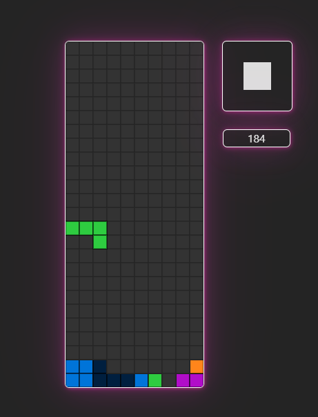

# Tetris in TypeScript

This is a simple Tetris game implemented in TypeScript. Have fun playing and customizing your own Tetris game!

## Screenshots

## Features

-  Fully functional Tetris game.
-  Implemented in TypeScript for cleaner and more maintainable code.
-  Keyboard control support.
-  Scoring system.

## Customization

You can customize the game by adjusting constants located in the "constants" folder (`./src/core/constants`):

* Board size (cols, rows).
* Colors and design.

To adjust the game's falling behavior, you should modify variables within the `update` function in `initTetris`.
